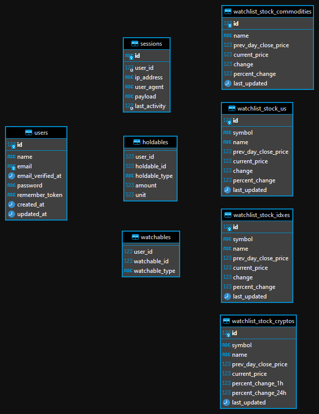

    
    
    

# LMP Stock Watcher

> **Daftar isi**
> - [Pengantar](#pengantar)
> - [Requirement Aplikasi](#requirement-aplikasi)
> - [Langkah-langkah dalam pengaplikasian sistem](#langkah-langkah-dalam-pengaplikasian-sistem)
> - [Framework yang digunakan](#framework-yang-digunakan)
> - [Dokumentasi](#dokumentasi)
> - [ER Diagram](#er-diagram)
> - [Catatan](#catatan)
> - [Kontak](#kontak)

## Pengantar

LMP Stock Watcher adalah aplikasi berbasis website yang berfungsi untuk memantau harga saham Indonesia, saham US, uang kripto dan komoditas. Aplikasi ini memantau harga melalui komunikasi antar muka pemrograman dan juga scraping website. Tidak hanya memantau harga, aplikasi web ini juga dapat menghitung aset saham dengan harga terkini sehingga pengguna tahu total aset yang dimilikinya.

## Requirement Aplikasi

Pastikan Anda sudah menginstall :

- [PHP ( _min 7.4.\*_ )](https://www.php.net/downloads.php)

- [MySQL Server](https://dev.mysql.com/downloads/mysql/)

- [Composer](https://getcomposer.org/download/)

## Framework yang digunakan

- [Framework Laravel versi 8](https://laravel.com/docs/8.x)

- [Framework Vue versi 2.6](https://vuejs.org/v2/guide/)

## Langkah-langkah dalam pengaplikasian sistem

Berikut adalah langkah-langkah yang harus dilakukan untuk mengaplikasikan sistem ini.

#### 1. Clone repository

Lakukan sintaks _clone repository_ seperti sintaks dibawah ini. 

    git clone https://github.com/dapurkode-com/lmp-stock-watcher.git

atau dengan mengunduh _repository_ ini kemudian _extract zip file_.

#### 2. Download vendor-vendor PHP.

Masuk ke dalam _folder repository_  kemudian jalankan sintaks `composer install`.

#### 3. Buat file _.env_

Buat file baru dengan nama _.env_ dengan isi file menyalin konten dari file _.env.example_ . Sesuaikan pada bagian konfigurasi berikut ini.

    DB_HOST=127.0.0.1
    DB_PORT=3306
    DB_DATABASE=laravel
    DB_USERNAME=root
    DB_PASSWORD=

    PUSHER_APP_ID=
    PUSHER_APP_KEY=
    PUSHER_APP_SECRET=
    PUSHER_APP_CLUSTER=mt1    

    FINNHUB_KEY=
    COINMARKETCAP_KEY=

#### 4. Generate key

_Generate key encryption_ aplikasi dengan menjalankan sintaks `php artisan key:generate`.

#### 5. Jalankan migrasi _database_ dan _seeder_

Setelah anda memastikan pengaturan basis data di _file .env_ telah sesuai, jalankan sintaks `php artisan migrate --seed` untuk melakukan migrasi.

## Dokumentasi

Dokumentasi dari REST API aplikasi dapat dilihat pada halaman `/api/docs` setelah menjalankan aplikasi.

## ER Diagram

Untuk menjalankan fungsinya, aplikasi LMP Stock Watcher membutuhkan media penyimpanan data yang disebut dengan basis data.  Basis data dari aplikasi LMP Stock Watcher menggunakan basis data MySQL dengan _engine InnoDB_. Struktur dari basis data dari aplikasi LMP Stock Watcher dapat ditunjukan sebagai berikut.

Terdapat 8 tabel yang ada pada basis data LMP Stock Watcher. Tabel _users_ menyimpan data _admin_ yang nantinya bisa mengganti aset yang dipantau dan juga disimpan. Tabel _sessions_ adalah tabel yang berfungsi menyimpan data saat _admin_ masuk ke dalam aplikasi. Tabel _holdables_ menyimpan daftar aset yang dimiliki, sedangkan tabel _watchables_ menyimpan daftar aset yang dipantau. Tabel _watchlist_stock_commodities_, _watclist_stock_us_, _watchlist_stock_idxes_, _watchlist_stock_cryptos_ masing-masing menyimpan data harga komoditas, saham US, saham saham Indonesia serta harga mata uang krypto.

## Catatan 

Beberapa catatan penting yang perlu diingat.
- Untuk menjalankan aplikasi secara lokal, jalankan sintak `php artisan serve` dan program akan berjalan di `http://localhost:8000`.
- Untuk menjalankan aplikasi secara cloud, silahkan kontak programmer ataupun _system admin_.
- Aplikasi akan mengamati harga aset melalui _cron job_. Untuk melakukan pengaturan, ikuti [langkah ini](https://laravel.com/docs/8.x/scheduling#running-the-scheduler) atau bisa dengan mengontak _system admin_.

## Kontak
> Jika mengalami kendala silahkan kirim _email_ melalui [i.g.b.n.satyawibawa@gmail.com](mailto:i.g.b.n.satyawibawa@gmail.com)

